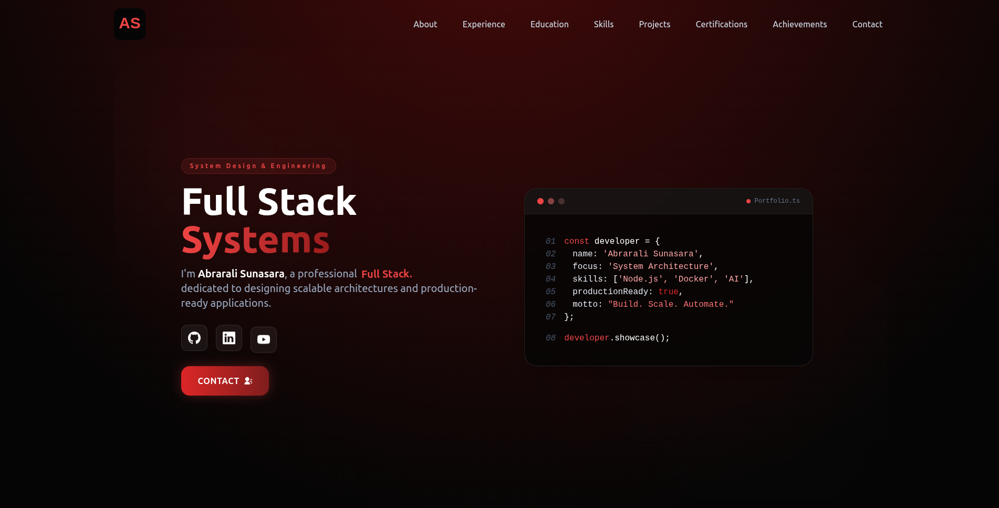

# 🌐 Personal Portfolio — Abrarali Sunasara

A modern, responsive developer portfolio showcasing **AI systems, full-stack applications, and system design projects**.

🔴 Live: https://abrarali.vercel.app/



## 🚀 About

This portfolio highlights my work in:

- AI-driven systems  
- Distributed architectures  
- Full-stack applications  
- System design and automation  

Focused on building scalable, production-ready solutions.

## 🛠️ Tech Stack

- **Frontend:** React, TypeScript, Tailwind CSS  
- **Backend:** Node.js, Express, FastAPI  
- **Database:** PostgreSQL, Supabase  
- **AI/ML:** LLMs, OpenRouter, Transformers  
- **Tools:** Docker, Git, Cloudflare  

## ✨ Features

- Fully responsive UI (mobile-first)  
- Dynamic project showcase  
- AI + system design focused projects  
- Clean architecture and modular code  
- Smooth animations and optimized performance  

## 📂 Featured Projects

- **TIPS** — Temporal Interview Profiling System  
- **GitStore** — Distributed storage using GitHub  
- **SurveySense** — AI-powered survey platform  
- **OpenClaw** — Multi-agent orchestration system  

## ⚙️ Run Locally

```bash
git clone https://github.com/AbraraliS/portfolio-exp
cd portfolio-exp
npm install
npm run dev
```

## 🚀 Deployment

Deployed on **Vercel**

🔗 https://abrarali.vercel.app/

## 📬 Contact

- GitHub: https://github.com/AbraraliS  
- LinkedIn: https://linkedin.com/in/abraralis
- YouTube: https://www.youtube.com/@abraralis7  

## 🔮 Future Improvements

- Add blog section  
- Enhance animations  
- Improve accessibility  
- Add analytics dashboard  
